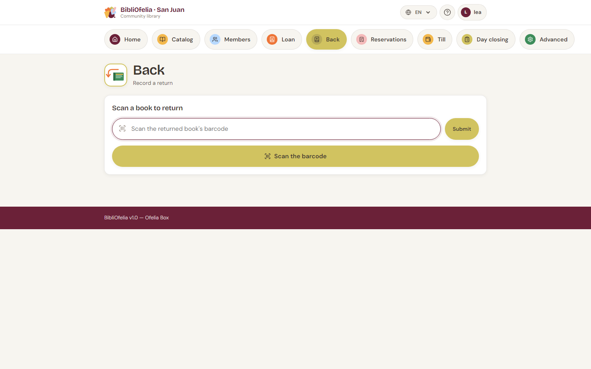

# Register a return

A return is even faster than a loan: you don't need to identify the
member, the book is enough.

## Open the Return page

From the top navigation bar, click the
[**Return**](/bibliofelia/en/loans/return/){ target="_blank" } tile.

## Scan the books

Scan the returned books one after another. Each scan:

1. Marks the loan as **Returned**
2. Shows **who is bringing the book back** (photo, first name, last
   name, age when they exist), the title, the copy codes, and the
   mention **Return done**
3. Clears the field for the next book

You can chain a whole pile of returns in seconds.

!!! tip "No scanner?"
    Click **Scan a book** to open your [device's
    camera](../premiers-pas/scanner-camera.md), or type the copy's code on
    the keyboard then **Enter** / **Validate**.

## Edge cases

### The book is not on loan

If you scan a book that was not on loan, BibliOfelia warns you with
an orange message. Check:

- You haven't confused two similar books
- The previous return wasn't already recorded

### The book is overdue

The return is recorded normally, with no blocking message — we don't
want to slow down returns. If you want to remind the member the book
was overdue, do so verbally.

To track overdue returns systematically, see [Common cases: long
overdue](../faq.md#retard).

### The book triggers a reservation

If someone reserved this book, BibliOfelia displays it at the top of
the page with the member's name and **Set aside**. This signals you
to store the book in the pickup area instead of putting it back on
the shelf.

See [Reservations](../reservations/retrait.md).

## What's next?

Once the return is done, the book is **Available** again: you can
shelve it or set it aside if a reservation was waiting.
