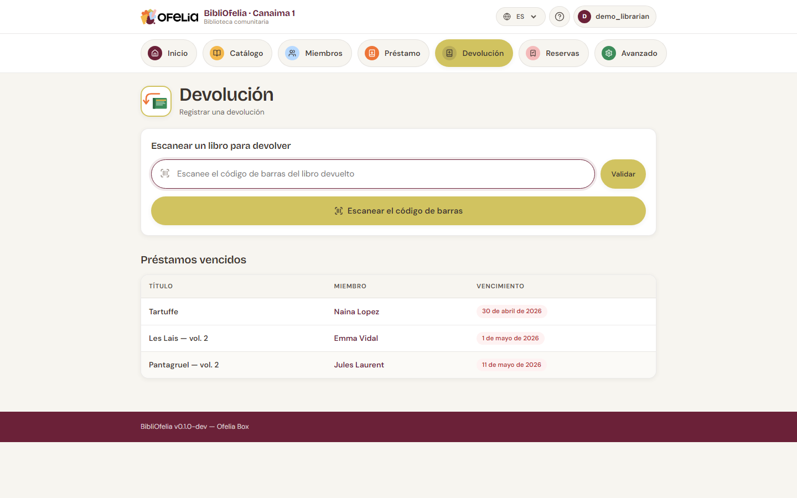

# Registrar una devolución

La devolución es aún más rápida que el préstamo: no hay necesidad de
identificar al miembro, basta con el libro.

## Abrir la página Devolución

Desde la barra de navegación de arriba, haga clic en la tarjeta
**Devolución**.

## Escanear los libros

Escanee los libros devueltos uno tras otro. Cada escaneo:

1. Marca el préstamo como **Devuelto**
2. Muestra brevemente el nombre del miembro y el título confirmados
3. Vacía el campo para el siguiente libro

Puede encadenar toda una pila de devoluciones en segundos.

!!! tip "¿Sin escáner?"
    Haga clic en **Escanear un libro** para abrir la [cámara de su
    dispositivo](../premiers-pas/scanner-camera.md), o escriba el código del
    ejemplar con el teclado y luego **Enter** / **Validar**.

## Casos particulares

### El libro no está prestado

Si escanea un libro que no estaba prestado, BibliOfelia le avisa con
un mensaje naranja. Verifique:

- No ha confundido dos libros similares
- La devolución anterior no se había registrado

### El libro está vencido

La devolución se registra normalmente, sin mensaje bloqueante — no
queremos ralentizar la devolución. Si quiere informar al miembro que
el libro estaba vencido, hágalo de viva voz.

Para seguir los atrasos sistemáticamente, vea [Casos frecuentes:
atraso prolongado](../faq.md#retard).

### El libro desencadena una reserva

Si alguien había reservado este libro, BibliOfelia lo muestra arriba
de la página con el nombre del miembro y la mención **A poner de
lado**. Es la señal para guardar el libro en la zona de recogida en
lugar de devolverlo al estante.

Vea [Reservas](../reservations/retrait.md).

## ¿Y después?

Una vez hecha la devolución, el libro vuelve a estar **Disponible**:
puede colocarlo en el estante o ponerlo de lado si una reserva
estaba esperándolo.
