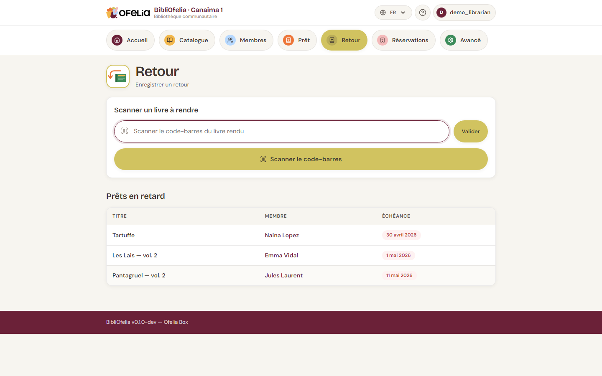

# Enregistrer un retour

Le retour est encore plus rapide que le prêt : il n'y a pas besoin
d'identifier le membre, le livre suffit.

## Ouvrir la page Retour

Depuis la barre de navigation en haut, cliquez sur la tuile **Retour**.

## Scanner les livres

Scannez les livres rendus l'un après l'autre. Chaque scan :

1. Marque le prêt comme **Retourné**
2. Affiche brièvement le nom du membre et le titre confirmés
3. Vide le champ pour le livre suivant

Vous pouvez enchaîner toute une pile de retours en quelques secondes.

!!! tip "Pas de douchette ?"
    Tapez le code de l'exemplaire au clavier puis **Entrée**, ou
    cliquez sur **Valider**. Vous pouvez aussi utiliser OfeliaScan
    depuis le téléphone.

## Cas particuliers

### Le livre n'est pas en prêt

Si vous scannez un livre qui n'était pas emprunté, BibliOfelia vous
prévient avec un message orange. Vérifiez :

- Vous n'avez pas confondu deux livres similaires
- Le retour précédent n'avait pas été enregistré

### Le livre est en retard

Le retour est enregistré normalement, sans message bloquant — on ne
veut pas ralentir le retour. Si vous souhaitez signaler au membre que
le livre était en retard, c'est à vous de le faire de vive voix.

Pour suivre les retards systématiquement, voir
[Cas courants : retard prolongé](../cas-courants/retard.md).

### Le livre déclenche une réservation

Si quelqu'un avait réservé ce livre, BibliOfelia l'affiche en haut de
la page avec le nom du membre et la mention **À mettre de côté**.
C'est le signal pour ranger le livre dans la zone de retrait au lieu
de le remettre en rayon.

Voir [Réservations](../reservations/retrait.md).

## Et après ?

Une fois le retour fait, le livre repasse en **Disponible** : vous
pouvez le ranger en rayon ou le mettre de côté si une réservation
l'attendait.
