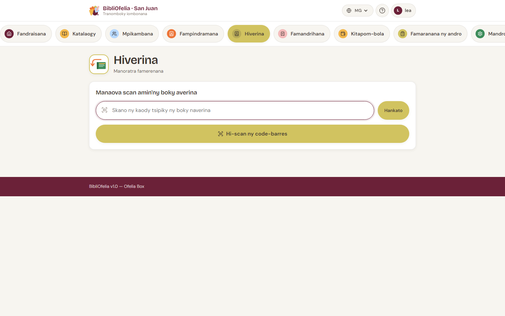

# Manoratra famerenana

Haingana kokoa noho ny fampindramana ny famerenana: tsy mila
mahafantatra ny mpianatra, ny boky no ampy.

## Sokafy ny pejy Famerenana

Avy amin'ny tsipika fitetezana ambony, click amin'ny karatra
[**Famerenana**](/bibliofelia/mg/loans/return/){ target="_blank" }.

## Hijery ireo boky

Jereo ireo boky averina iray manarakaraka. Scan tsirairay dia:

1. Misy marika fa **Voaverina** ny fampindramana
2. Mampiseho vetivety ny anaran'ny mpianatra sy ny lohateny
   voamarina
3. Manaisotra ny toerana ho an'ny boky manaraka

Azonao atao ny mampifandimby antontana boky famerenana ao anatin'ny
segondra.

!!! tip "Tsy misy scanner?"
    Tsindrio **Hijery boky** mba hanokatra ny [fakantsarin'ny
    fitaovanao](../premiers-pas/scanner-camera.md), na soraty ny code an'ny
    kopia amin'ny clavier dia **Enter** / **Hanamarina**.

## Toe-javatra manokana

### Tsy nampindraina ny boky

Raha mijery boky tsy nampindraina ianao, ny BibliOfelia dia
mampitandrina anao amin'ny hafatra volom-boasary. Hamarino:

- Tsy nampifangaroinao boky roa mitovy
- Tsy efa voasoratra teo aloha ny famerenana taloha

### Tara ny boky

Voasoratra mahazatra ny famerenana, tsy misy hafatra fisakanana —
tsy te-hampihena ny famerenana isika. Raha te hampandre ny
mpianatra hoe tara ny boky ianao, ataovy am-bava izany.

Mba hanaraha-maso ireo tara amin'ny fomba mitohy, jereo [Ohatra:
tara mihalava](../faq.md#retard).

### Mamoaka famandrihana ny boky

Raha nisy nanao famandrihana ity boky ity, ny BibliOfelia dia
mampiseho azy any ambonin'ny pejy miaraka amin'ny anaran'ny
mpianatra sy ny soratra **Atao etsy ankilany**. Io no famantarana
mba hametrahana ny boky ao amin'ny toerana fakana fa tsy averina
ao amin'ny rakitra.

Jereo [Famandrihana](../reservations/retrait.md).

## Ary avy eo?

Rehefa vita ny famerenana, ny boky dia lasa **Misy** indray:
azonao ampetraka ao amin'ny rakitra na atao etsy ankilany raha
nisy famandrihana niandry azy.
