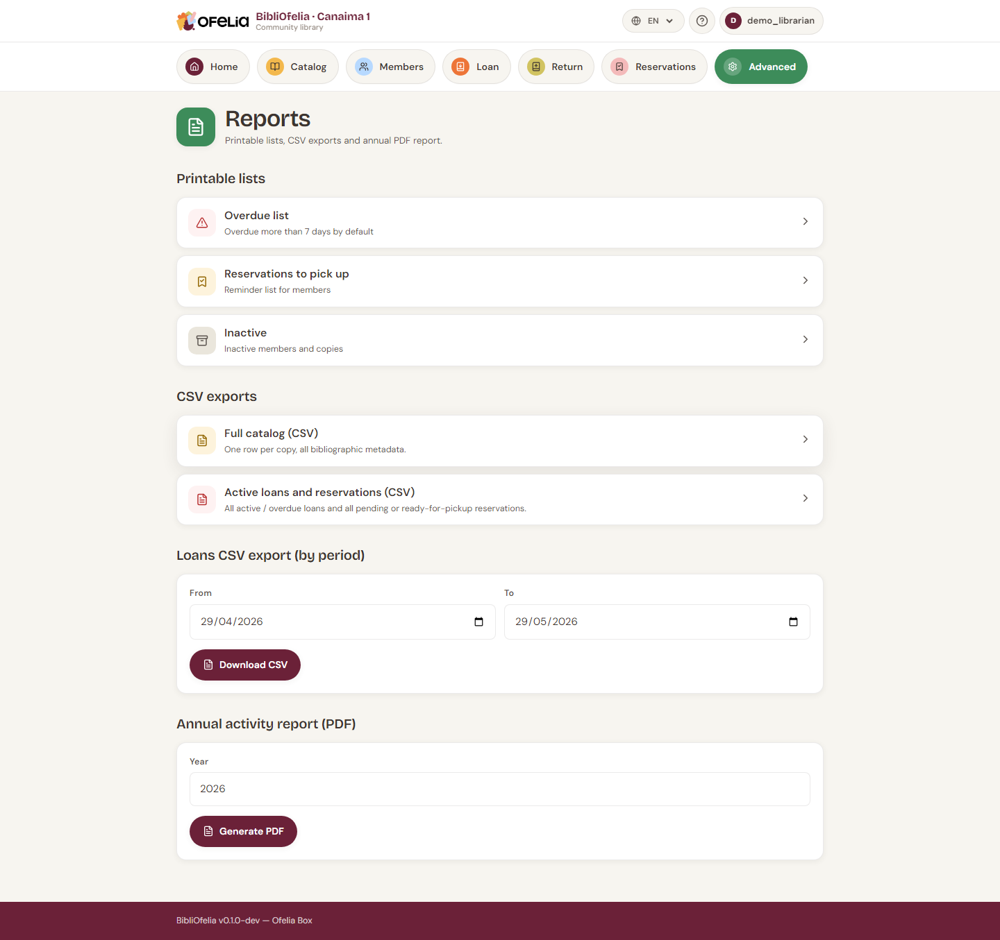

# CSV exports

To analyze your data in a spreadsheet (LibreOffice Calc, Excel) or
to send it to a partner (city hall, association, funder), BibliOfelia
offers exports in **CSV** format.

## Where to find exports

**Advanced → [Reports](/bibliofelia/en/reports/){ target="_blank" }**.

## Available exports

### Catalog (CSV)

List of all records with: title, authors, ISBN, category, year,
language, number of copies.

Useful for: **annual inventory**, sharing your collection with another
library.

### Loans (CSV)

Loan history over a period. Filterable by date, member category,
book category.

Useful for: **usage statistics**, annual activity report.

### Inactive members (CSV)

List of members who haven't borrowed for N months.

Useful for: **follow-up campaign**, updating the mailing list.

### Inactive copies (CSV)

List of copies that haven't been borrowed for N months.

Useful for: **weeding** (removing books that never circulate), aisle
reorganization.

## How to use a CSV

1. Click the export link
2. The `.csv` file downloads
3. Open it in LibreOffice Calc, Excel or Google Sheets

Columns are separated by **commas**. All accented characters (à, é,
è, ô, ï…) display correctly in LibreOffice Calc and Google Sheets.

!!! tip "If Excel opens everything in a single column"
    French Excel expects semicolons as separators by default. Use
    **Data → From Text/CSV** and specify "comma" as separator — your
    columns will appear correctly.

## What about a full annual report?

To generate a synthetic annual PDF report (to attach to a funding
application), use **Annual PDF report** from the same page.
