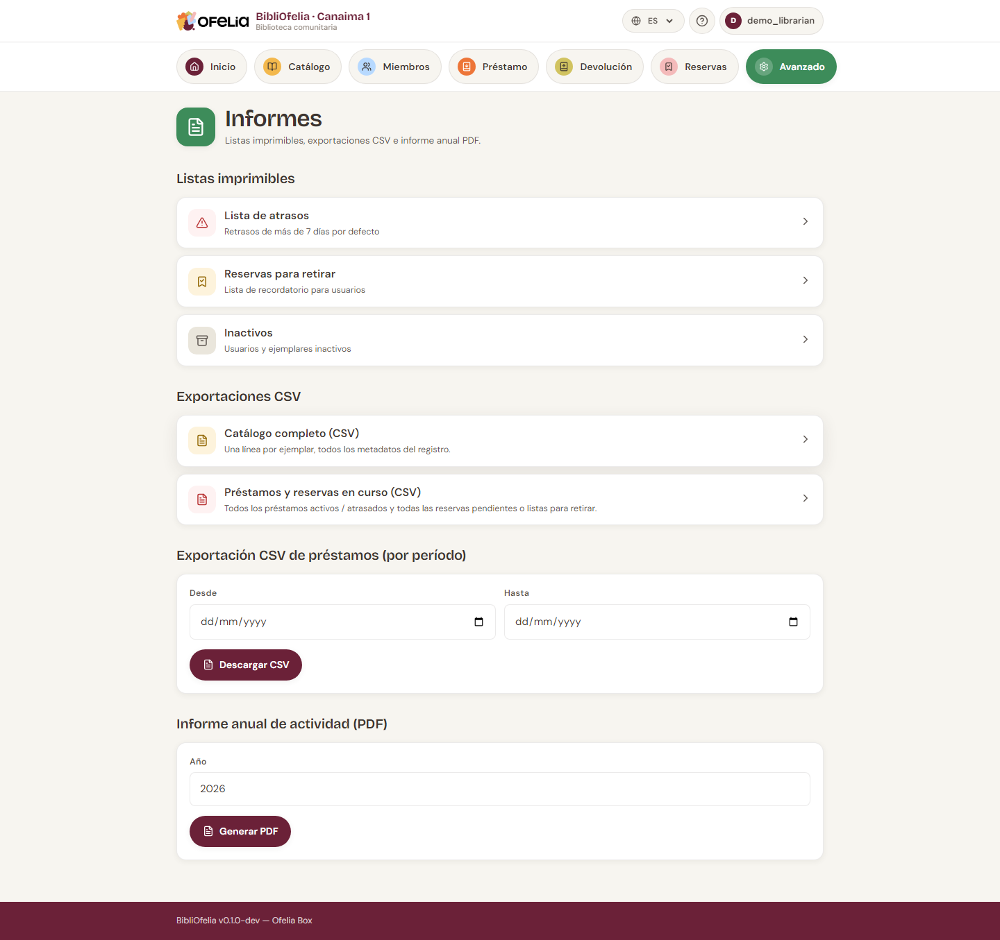

# Exportaciones CSV

Para analizar sus datos en una hoja de cálculo (LibreOffice Calc,
Excel) o transmitirlos a un colaborador (ayuntamiento, asociación,
financiador), BibliOfelia ofrece exportaciones en formato **CSV**.

## Dónde encontrar las exportaciones

**Avanzado → Informes**.

## Las exportaciones disponibles

### Catálogo (CSV)

Lista de todos los registros con: título, autores, ISBN, categoría,
año, idioma, número de ejemplares.

Útil para: **inventario anual**, compartir su fondo con otra
biblioteca.

### Préstamos (CSV)

Historial de los préstamos en un periodo. Filtrable por fecha,
categoría de miembro, categoría de libro.

Útil para: **estadísticas de uso**, informe de actividad anual.

### Miembros inactivos (CSV)

Lista de los miembros que no han prestado desde hace N meses.

Útil para: **operación de seguimiento**, actualización de la lista
de difusión.

### Ejemplares inactivos (CSV)

Lista de los ejemplares que no se han prestado desde hace N meses.

Útil para: **expurgo** (sacar del catálogo los libros que nunca
salen), reorganización de los estantes.

## Cómo usar un CSV

1. Haga clic en el enlace de exportación
2. El archivo `.csv` se descarga
3. Ábralo en LibreOffice Calc, Excel o Google Sheets

Las columnas están separadas por **comas**. Todos los caracteres
acentuados (á, é, í, ó, ñ…) se muestran correctamente en
LibreOffice Calc y Google Sheets.

!!! tip "Si Excel abre todo en una sola columna"
    Excel francés/español espera por defecto el punto y coma como
    separador. Use **Datos → Desde el texto/CSV** e indique "coma"
    como separador — sus columnas aparecerán correctamente.

## ¿Y un informe anual completo?

Para generar un informe anual sintético en PDF (a adjuntar a un
expediente de subvención), use **Informe anual PDF** desde la misma
página.
