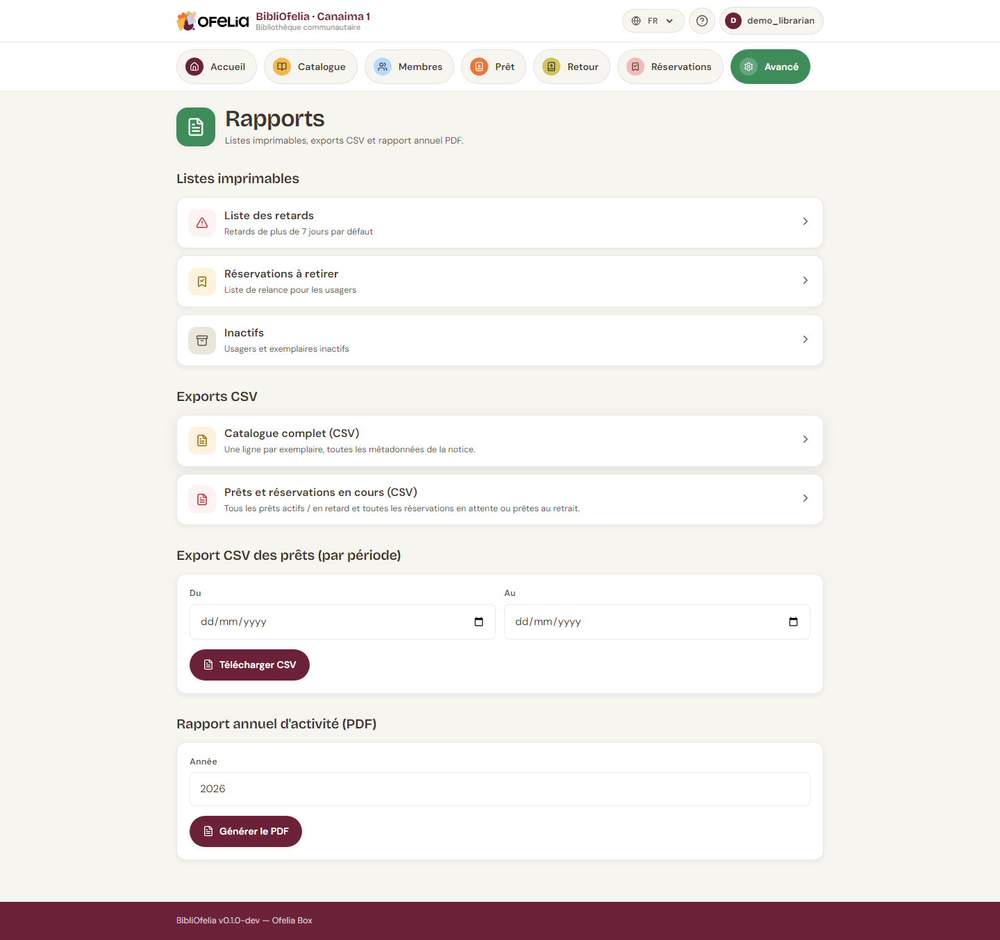

# Exports CSV

Pour analyser vos données dans un tableur (LibreOffice Calc, Excel) ou
les transmettre à un partenaire (mairie, association, financeur),
BibliOfelia propose des exports au format **CSV**.

## Où trouver les exports

**Avancé → [Rapports](/bibliofelia/fr/reports/){ target="_blank" }**.

## Les exports disponibles

### Catalogue (CSV)

Liste de toutes les notices avec : titre, auteurs, ISBN, catégorie,
année, langue, nombre d'exemplaires.

Utile pour : **inventaire annuel**, partage de votre fonds à une
autre bibliothèque.

### Prêts (CSV)

Historique des prêts sur une période. Filtrable par date, catégorie de
membre, catégorie de livre.

Utile pour : **statistiques d'usage**, rapport d'activité annuel.

### Membres inactifs (CSV)

Liste des membres qui n'ont pas emprunté depuis N mois.

Utile pour : **opération de relance**, mise à jour de la liste de
diffusion.

### Exemplaires inactifs (CSV)

Liste des exemplaires qui n'ont pas été empruntés depuis N mois.

Utile pour : **désherbage** (sortir du catalogue les livres qui ne
sortent jamais), réorganisation des rayons.

## Comment utiliser un CSV

1. Cliquez sur le lien d'export
2. Le fichier `.csv` se télécharge
3. Ouvrez-le dans LibreOffice Calc, Excel ou Google Sheets

Les colonnes sont séparées par des **virgules**. Tous les caractères
accentués (à, é, è, ô, ï…) s'affichent correctement dans LibreOffice
Calc et Google Sheets.

!!! tip "Si Excel ouvre tout dans une seule colonne"
    Excel français attend par défaut le point-virgule comme séparateur.
    Utilisez **Données → Depuis le texte/CSV** et indiquez "virgule"
    comme séparateur — vos colonnes apparaîtront correctement.

## Et un export annuel complet ?

Pour générer un PDF rapport annuel synthétique (à joindre à un dossier
de subvention), utilisez **Rapport annuel PDF** depuis la même page.
