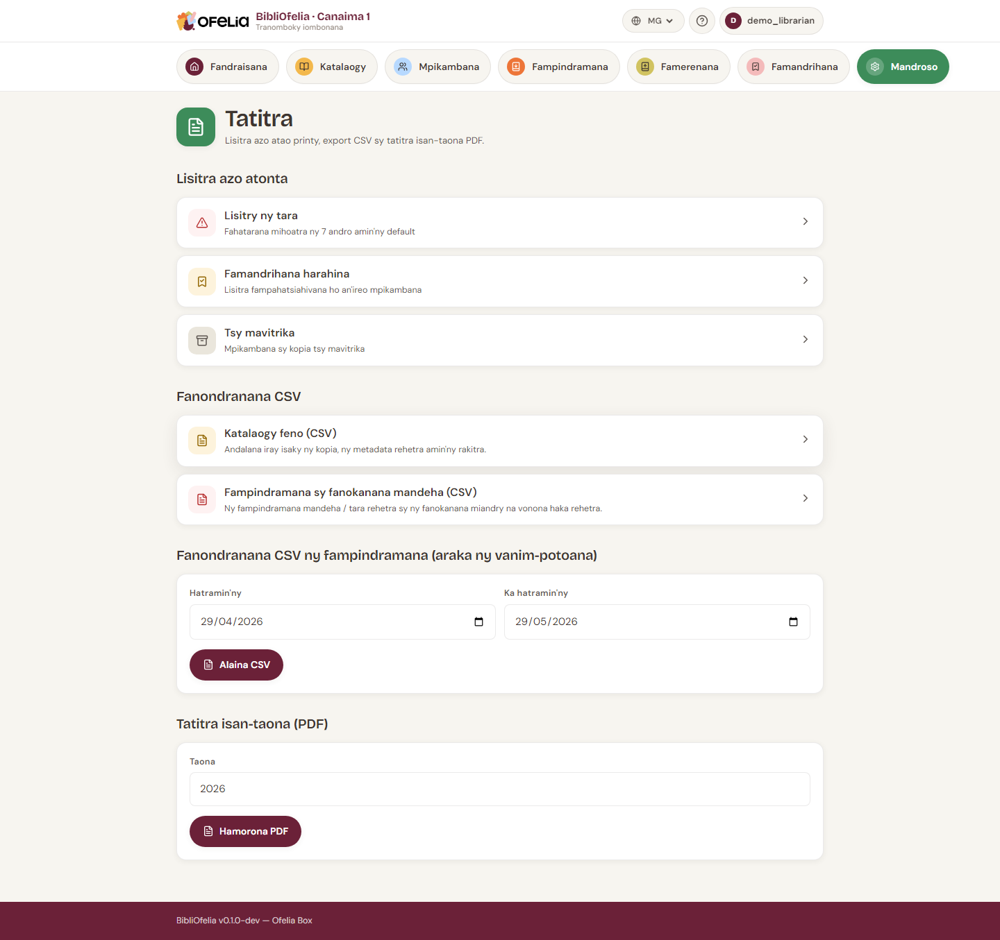

# Fanondranana CSV

Mba handinihana ny angonao ao amin'ny tableur (LibreOffice Calc,
Excel) na handefa azy amin'ny mpiara-miasa (kaomina, fikambanana,
mpamatsy vola), ny BibliOfelia dia manolotra fanondranana amin'ny
endrika **CSV**.

## Aiza no ahitana ny fanondranana

**Mandroso → [Tatitra](/bibliofelia/mg/reports/){ target="_blank" }**.

## Ireo fanondranana azo

### Boky (CSV)

Lisitry ny notice rehetra misy: lohateny, mpanoratra, ISBN, sokajy,
taona, fiteny, isan'ny kopia.

Mahasoa ho an'ny: **inventaire isan-taona**, fizarana ny tahirinao
amin'ny tranomboky hafa.

### Fampindramana (CSV)

Tantaran'ny fampindramana amin'ny vanim-potoana. Azo fitanina araka
ny daty, sokajy mpianatra, sokajy boky.

Mahasoa ho an'ny: **statistika fampiasana**, tatitra asa isan-taona.

### Mpianatra tsy mavitrika (CSV)

Lisitry ny mpianatra izay tsy nampindrana hatramin'ny N volana.

Mahasoa ho an'ny: **fampandrenesana**, fanavaozana ny lisitra
fizarana.

### Kopia tsy mavitrika (CSV)

Lisitry ny kopia izay tsy nampindraina hatramin'ny N volana.

Mahasoa ho an'ny: **désherbage** (mamoaka ao amin'ny boky ireo
tsy mivoaka mihitsy), fandaminana ny rakitra.

## Ahoana ny ampiasana CSV

1. Click amin'ny lien fanondranana
2. Hidina ny rakitra `.csv`
3. Sokafy ao amin'ny LibreOffice Calc, Excel na Google Sheets

Ny tsanganana dia sarahin'ny **faingo**. Ny litera misy accent
rehetra (à, é, è, ô, ï…) dia miseho marina ao amin'ny LibreOffice
Calc sy Google Sheets.

!!! tip "Raha mamoha ny rehetra ao amin'ny tsanganana iray ny Excel"
    Ny Excel frantsay dia miandry ny point-virgule ho mpanasaraka
    araka ny default. Ampiasao **Angona → Avy amin'ny lahatsoratra/CSV**
    dia ambarao "faingo" ho mpanasaraka — hiseho marina ny
    tsanganana.

## Ary tatitra isan-taona feno?

Mba hamoronana tatitra isan-taona fintinana amin'ny PDF (hapetaka
amin'ny rakitra fangataham-bola), ampiasao **Tatitra isan-taona
PDF** avy amin'ny pejy iray.
