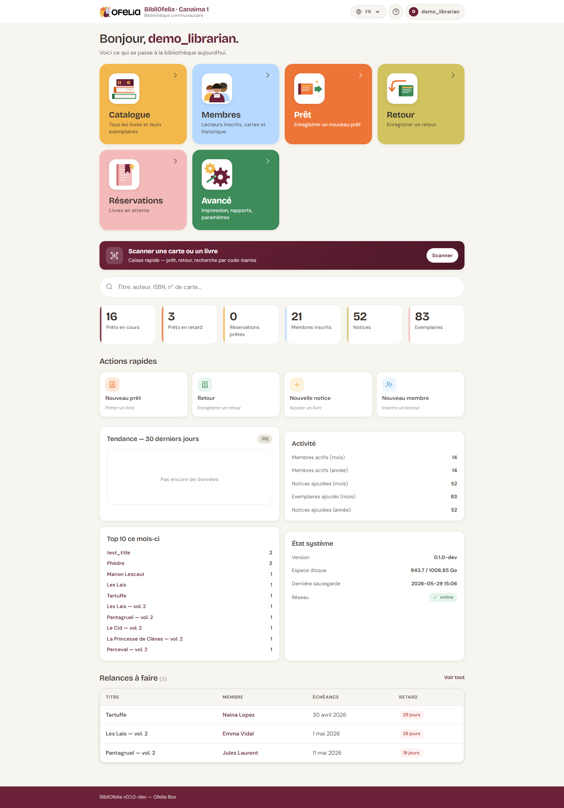

# KPIs du dashboard

Le tableau de bord affiche en permanence six **KPIs** (indicateurs
clés) qui résument l'état de la bibliothèque.

## Les six compteurs

### Prêts en cours

Nombre de livres actuellement empruntés. Inclut les prêts en cours et
en retard, mais pas les prêts terminés.

### Prêts en retard

Sous-ensemble des prêts en cours dont la date de retour est dépassée.
Cliquez dessus pour voir la
[liste détaillée](/bibliofelia/fr/reports/overdue/){ target="_blank" } et
appeler les membres.

### Réservations prêtes

Réservations dont le livre est disponible (déjà retourné, mis de côté).
Ce sont les notifications à faire.

### Membres inscrits

Total des cartes actives. N'inclut pas les membres désactivés ni les
cartes expirées.

### Notices

Nombre total de notices (fiches de livres) au catalogue.

### Exemplaires

Nombre total d'exemplaires physiques en bibliothèque. Toujours
supérieur ou égal au nombre de notices (une notice peut avoir plusieurs
copies).

## Suivi de l'activité

La section **Activité** complète les compteurs avec des chiffres sur
30 jours et 1 an :

- Membres actifs (ayant emprunté au moins une fois)
- Notices et exemplaires ajoutés
- Prêts mensuels et annuels

## Section État système

Pour les bibliothécaires, l'**État système** est utile pour repérer si
quelque chose ne va pas :

- **Espace disque** : si trop faible, prévenir l'administrateur
- **Dernière sauvegarde** : doit dater d'aujourd'hui ou hier
- **Réseau** : doit être "online" sauf pendant les coupures

## Pour aller plus loin

Pour des chiffres plus détaillés sur une période, voir
[Exports CSV](exports.md).
