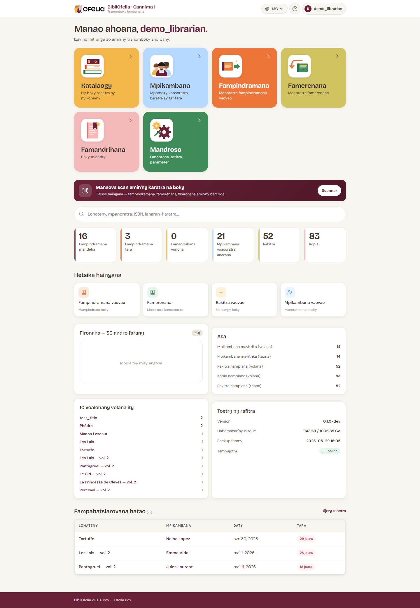

# KPI an'ny tabilao

Ny tabilao dia mampiseho mandrakariva KPI enina (mari-pamantarana
fototra) izay mamintina ny toetran'ny tranomboky.

## Ireo kaontera enina

### Fampindramana mihazo

Isan'ny boky nampindramin'ny olona ankehitriny. Misy ny fampindramana
mandeha sy tara, fa tsy ireo vita.

### Fampindramana tara

Sokajy an'ny fampindramana mihazo izay efa lasan'ny daty famerenana.
Click amin'ny izany mba hahitana ny
[lisitra antsipirihany](/bibliofelia/mg/reports/overdue/){ target="_blank" } sy
hiantsoana ny mpianatra.

### Famandrihana vonona

Famandrihana izay misy ny bokiny (efa naverina, napetraka ankilany).
Ireo no fampandrenesana hatao.

### Mpianatra voasoratra

Totalin'ny karatra mavitrika. Tsy misy ny mpianatra nampijanonina na
karatra tapitra.

### Notice

Isan'ny notice (takelaka boky) ao amin'ny boky.

### Kopia

Isan'ny kopia ara-batana ao amin'ny tranomboky. Mihoatra na mitovy
amin'ny isan'ny notice mandrakariva (notice iray dia afaka manana
kopia maro).

## Fanaraha-maso ny asa

Ny fizarana **Asa** dia manampy ny kaontera amin'ny isa amin'ny 30
andro sy 1 taona:

- Mpianatra mavitrika (nampindrana indray mandeha farafahakeliny)
- Notice sy kopia nampiana
- Fampindramana isam-bolana sy isan-taona

## Fizarana Toetran'ny rafitra

Ho an'ny mpitantana, **Toetran'ny rafitra** dia mahasoa mba
hahitana raha misy zavatra tsy mety:

- **Habetsahan'ny espace**: raha kely loatra, ampandreneso ny
  mpitantana
- **Savings farany**: tokony anio na omaly
- **Réseau**: tokony "online" raha tsy mandritra ny fitsaharana

## Mba handehana lavitra

Ho an'ny isa antsipirihany kokoa amin'ny vanim-potoana, jereo
[Fanondranana CSV](exports.md).
