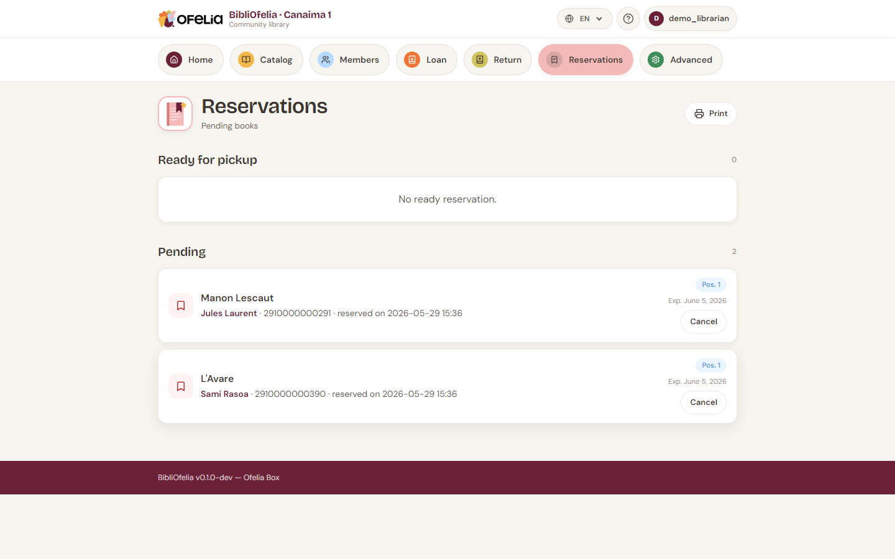

# Create a reservation

When a book is already on loan to someone and another member wants to
reserve it, you create a **reservation**: as soon as the book comes
back, it will be set aside for the next member.

## From the book's page

1. Open the [record page](../catalogue/recherche.md) of the requested
   book
2. Click **Reserve**
3. Identify the member (scan their card or type their name)
4. Validate

The reservation appears in the **Active reservations** list on the
book's page.

## See all reservations

From the top navigation bar, click **Reservations**.

The page lists all current reservations with:

- The **reserved book**
- The **waiting member**
- The **creation date**
- The **status**: Pending, Ready for pickup, Fulfilled, Expired

## Queue: several reservations on the same book

If several members reserve the same book, BibliOfelia automatically
manages the queue: the first to have reserved is served first when
the book returns.

The book's page shows the member's position in the queue
("reservation 2 of 3").

## Once the book is back

When the book is returned, BibliOfelia automatically updates the
first reservation to **Ready for pickup**. You then see:

- An alert on the **Return** page at scan time
- A notification in the **Notifications to do** section of the
  [dashboard](../premiers-pas/dashboard.md)

See the next steps: [Notifications and follow-ups](notifications.md),
then [Pickup and expiration](retrait.md).

## Cancel a reservation

If the member no longer wants the book, open the reservation and
click **Cancel**. The book becomes available again (or moves to the
next member in the queue).
