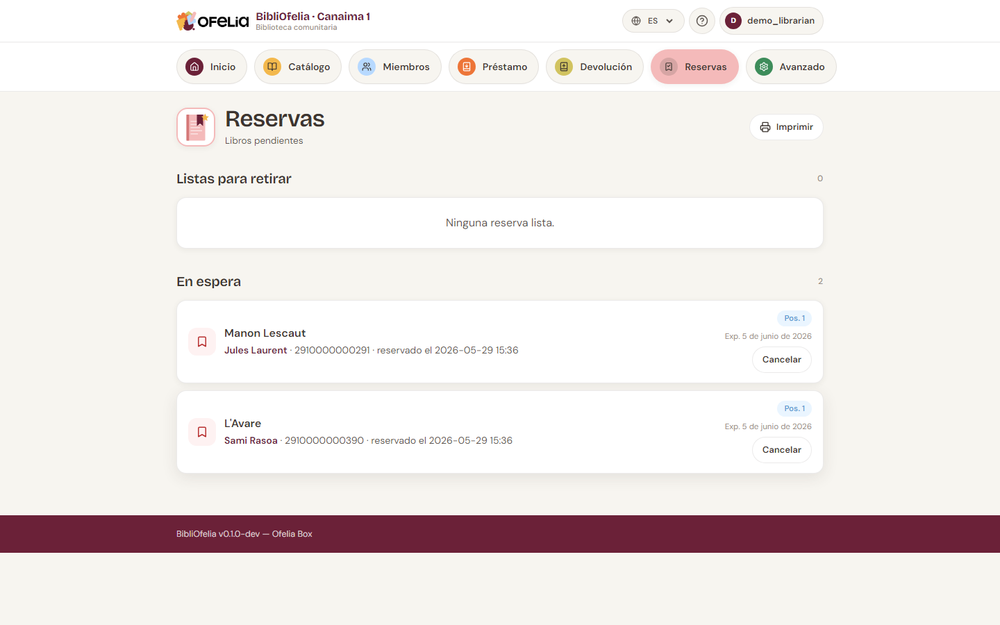

# Crear una reserva

Cuando un libro ya está prestado y otro miembro quiere reservarlo,
usted crea una **reserva**: en cuanto el libro vuelva, se pondrá de
lado para el siguiente miembro.

## Desde la ficha del libro

1. Abra la [ficha del registro](../catalogue/recherche.md) del libro
   solicitado
2. Haga clic en **Reservar**
3. Identifique al miembro (escanee su tarjeta o escriba su nombre)
4. Valide

La reserva aparece en la lista **Reservas activas** en la ficha del
libro.

## Ver todas las reservas

Desde la barra de navegación, haga clic en
[**Reservas**](/bibliofelia/es/loans/reservations/){ target="_blank" }.

La página lista todas las reservas activas con:

- El **libro** reservado
- El **miembro** que espera
- La **fecha** de creación
- El **estado**: Pendiente, Lista para recoger, Cumplida, Expirada

## Cola: varias reservas sobre un mismo libro

Si varios miembros reservan el mismo libro, BibliOfelia gestiona
automáticamente la cola: el primero en haber reservado se atiende
primero cuando el libro vuelve.

La ficha del libro muestra la posición del miembro en la cola
("reserva 2 de 3").

## Una vez vuelto el libro

Cuando el libro se devuelve, BibliOfelia actualiza automáticamente
la primera reserva a **Lista para recoger**. Entonces ve:

- Una alerta en la página **Devolución** al momento del escaneo
- Una notificación en la sección **Notificaciones por hacer** del
  [panel](../premiers-pas/dashboard.md)

Vea la continuación: [Notificaciones y seguimientos](notifications.md),
luego [Recogida y expiración](retrait.md).

## Cancelar una reserva

Si el miembro ya no quiere el libro, abra la reserva y haga clic en
**Cancelar**. El libro vuelve a estar disponible (o pasa al
siguiente miembro de la cola).
