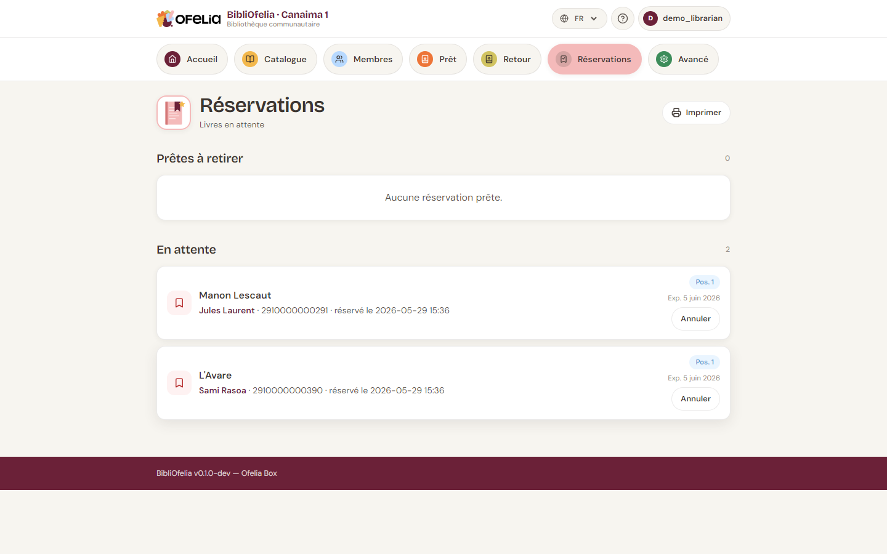

# Créer une réservation

Quand un livre est déjà prêté à quelqu'un et qu'un autre membre veut
le réserver, vous créez une **réservation** : dès que le livre revient,
il sera mis de côté pour le membre suivant.

## Depuis la fiche du livre

1. Ouvrez la [fiche de la notice](../catalogue/recherche.md) du livre
   demandé
2. Cliquez sur **Réserver**
3. Identifiez le membre (scannez sa carte ou tapez son nom)
4. Validez

La réservation apparaît dans la liste **Réservations en attente** sur
la fiche du livre.

## Voir toutes les réservations

Depuis la barre de navigation, cliquez sur **Réservations**.

La page liste toutes les réservations en cours avec :

- Le **livre** réservé
- Le **membre** qui attend
- La **date** de création
- Le **statut** : En attente, Prête à retirer, Honorée, Expirée

## File d'attente : plusieurs réservations sur un même livre

Si plusieurs membres réservent le même livre, BibliOfelia gère
automatiquement la file d'attente : le premier à avoir réservé est
servi en premier quand le livre revient.

La fiche du livre montre la position du membre dans la file
("réservation 2 sur 3").

## Une fois le livre revenu

Quand le livre est retourné, BibliOfelia met automatiquement à jour la
première réservation en **Prête à retirer**. Vous voyez alors :

- Une alerte sur la page **Retour** au moment du scan
- Une notification dans la section **Notifications à faire** du
  [tableau de bord](../premiers-pas/dashboard.md)

Voir la suite : [Notifications et relances](notifications.md), puis
[Retrait et expiration](retrait.md).

## Annuler une réservation

Si le membre ne veut plus du livre, ouvrez la réservation et cliquez
sur **Annuler**. Le livre redevient disponible (ou passe au membre
suivant dans la file d'attente).
