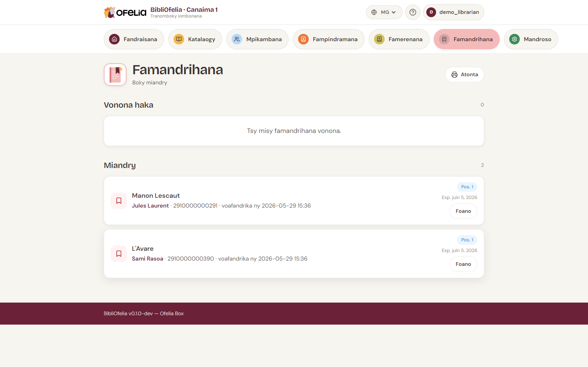

# Mamorona famandrihana

Rehefa efa nampindramin'ny olona ny boky ary misy mpianatra hafa te
hamandrika azy, dia mamorona **famandrihana** ianao: raha vao
miverina ny boky dia hapetraka etsy ankilany ho an'ny mpianatra
manaraka.

## Avy amin'ny takelaky ny boky

1. Sokafy ny [takelakan'ny notice](../catalogue/recherche.md) an'ny
   boky tadiavina
2. Click amin'ny **Hamandrika**
3. Mahafantatra ny mpianatra (jereo ny karatrany na soraty ny
   anarany)
4. Hamarino

Ny famandrihana dia miseho ao amin'ny lisitra **Famandrihana
mavitrika** amin'ny takelaky ny boky.

## Jereo ny famandrihana rehetra

Avy amin'ny tsipika fitetezana, click amin'ny **Famandrihana**.

Ny pejy dia mametaka ny famandrihana mihazo rehetra miaraka amin'ny:

- **Boky** voafarana
- **Mpianatra** miandry
- **Daty** famoronana
- **Toetra**: Miandry, Vonona ho an'ny fakana, Voaravaka, Tapitra

## Filaharana: famandrihana maro amin'ny boky iray

Raha mpianatra maro no manao famandrihana an'ny boky iray, ny
BibliOfelia dia mitantana automatika ny filaharana: ny voalohany
nanao famandrihana dia hovaliana voalohany rehefa miverina ny boky.

Ny takelakan'ny boky dia mampiseho ny toeran'ny mpianatra ao amin'ny
filaharana ("famandrihana 2 amin'ny 3").

## Rehefa tafaverina ny boky

Rehefa naverina ny boky, ny BibliOfelia dia manavao automatika ny
famandrihana voalohany ho **Vonona ho an'ny fakana**. Avy eo
mahita ianao:

- Fampitandremana amin'ny pejy **Famerenana** amin'ny fotoana scan
- Fampandrenesana ao amin'ny fizarana **Fampandrenesana hatao** an'ny
  [tabilao](../premiers-pas/dashboard.md)

Jereo ny mitohy: [Fampandrenesana sy tara hatonina](notifications.md),
dia [Fakana sy fahataperana](retrait.md).

## Manafoana famandrihana

Raha tsy tian'ny mpianatra intsony ny boky, sokafy ny famandrihana
dia click amin'ny **Foanana**. Ny boky dia lasa misy indray (na
mandeha amin'ny mpianatra manaraka ao amin'ny filaharana).
