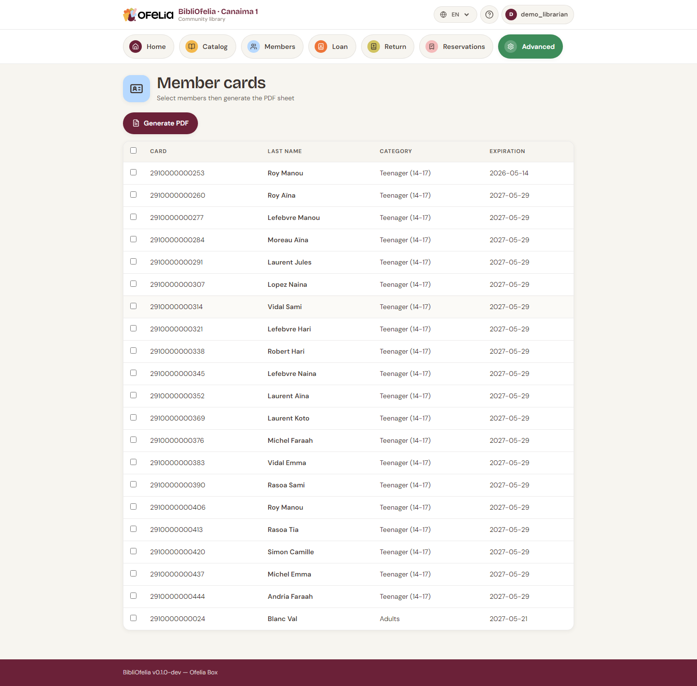

# Member card

Each member has a physical card with a barcode. It identifies them
quickly during a loan.

## Print a single card

From the [member profile](fiche.md), click **Print card** (or go to
**Advanced → Printing → Cards**).

## Print several cards at once

For new enrollments, it is more efficient to batch:

1. Open **Advanced → Printing → Cards**
2. Filter the members to print (for example, "enrolled this month")
3. Tick the wanted cards
4. Click **Generate PDF**

The PDF opens in a new tab: you can print it directly or save it for
later.

## Card format

BibliOfelia cards are standard business card size (85 × 54 mm) with:

- **OFELIA logo** as watermark
- **Member photo** (top left, if provided)
- **Last name and first name** in large font
- **Card number** and **EAN-13 barcode**
- **Expiration date**
- A **flag** indicating the member's preferred language

The background is cream, consistent with the OFELIA brand.

!!! tip "Which paper to use?"
    For a sturdy card, print on 200-300 g/m² paper then laminate.
    You can also print on sticky labels to stick onto pre-printed
    blank cards.

## Replace a card

If a member loses their card, you must assign a **new number** (not
reprint the old one) to invalidate the lost card:

1. Open the member's profile
2. Click **Replace card**
3. Confirm

A new number is assigned and the old one is "retired": it will never
be reassigned to another member (see [Common cases: lost
card](../cas-courants/carte-perdue.md)).

Then print the new card normally.

## See also

- [Lost or stolen card](../cas-courants/carte-perdue.md)
- [Renewal and expiration](renouvellement.md)
