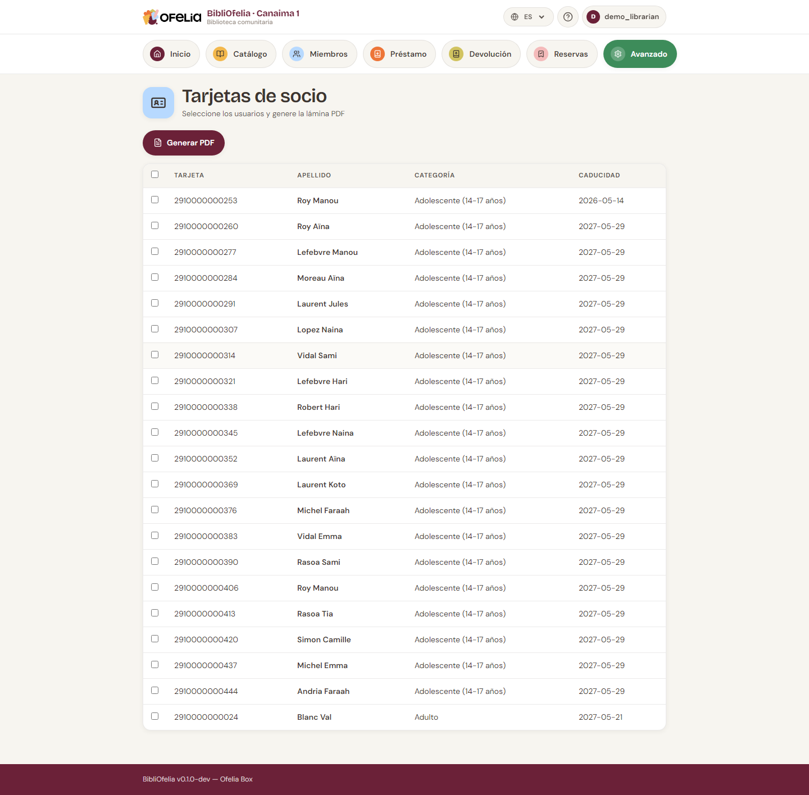

# Tarjeta de miembro

Cada miembro dispone de una tarjeta física con un código de barras.
Es ella la que permite identificarlo rápidamente durante un préstamo.

## Imprimir una sola tarjeta

Desde la [ficha del miembro](fiche.md), haga clic en **Imprimir la
tarjeta (62 mm)**: el PDF de cinta Brother QL se abre en una
pestaña nueva.

Para una plancha A4 (varias tarjetas), vaya a **Avanzado → Impresión
→ Tarjetas**.

## Imprimir varias tarjetas a la vez

Para las nuevas inscripciones, es más eficiente agrupar:

1. Abra **Avanzado → Impresión →
   [Tarjetas](/bibliofelia/es/printing/cards/){ target="_blank" }**
2. Filtre los miembros a imprimir (por ejemplo, "inscritos este
   mes")
3. Marque las tarjetas deseadas
4. Haga clic en **Generar el PDF**

El PDF se abre en una nueva pestaña: puede imprimirlo directamente o
guardarlo para más tarde.

## Formato de la tarjeta

Las tarjetas BibliOfelia tienen el formato estándar de tarjeta de
visita (85 × 54 mm) con:

- Logo **OFELIA** en filigrana
- **Foto del miembro** (arriba a la izquierda, si se proporciona)
- **Nombre y apellido** en grande
- **Número de tarjeta** y **código de barras EAN-13**
- **Fecha de expiración**
- Una **bandera** que indica el idioma preferido del miembro

El fondo es crema para coherencia con la marca OFELIA.

!!! tip "¿Qué papel usar?"
    Para una tarjeta sólida, imprima en papel de 200-300 g/m² y
    luego plastifique. También puede imprimir en etiquetas
    adhesivas para pegarlas en tarjetas preimpresas vírgenes.

## Reemplazar una tarjeta

Si un miembro pierde su tarjeta, debe asignar un **nuevo número**
(no reimprimir el antiguo) para invalidar la tarjeta perdida:

1. Abra la ficha del miembro, luego **Modificar**
2. Haga clic en **Reemplazar la tarjeta** (junto al n.º de tarjeta)
3. Confirme el aviso

Se asigna un nuevo número y el antiguo se "retira": nunca será
reasignado a otro miembro (vea [Casos frecuentes: tarjeta
perdida](../faq.md#carte-perdue)).

Luego imprima la nueva tarjeta normalmente.

## La familia en el carné

Si el usuario tiene personas asociadas a su carné (véase
[Inscribir a un miembro](inscription.md)), sus nombres se imprimen en una
**columna «Familia»** a la derecha del carné.

Es lo que permite ver de un vistazo, en el mostrador, quién puede tomar prestado
con este carné, sin abrir la ficha.

Si hay más nombres de los que caben, la lista termina con «…». La ficha del
usuario, en cambio, los muestra todos.

## Ver también

- [Tarjetas perdidas o robadas](../faq.md#carte-perdue)
- [Renovación y expiración](renouvellement.md)
