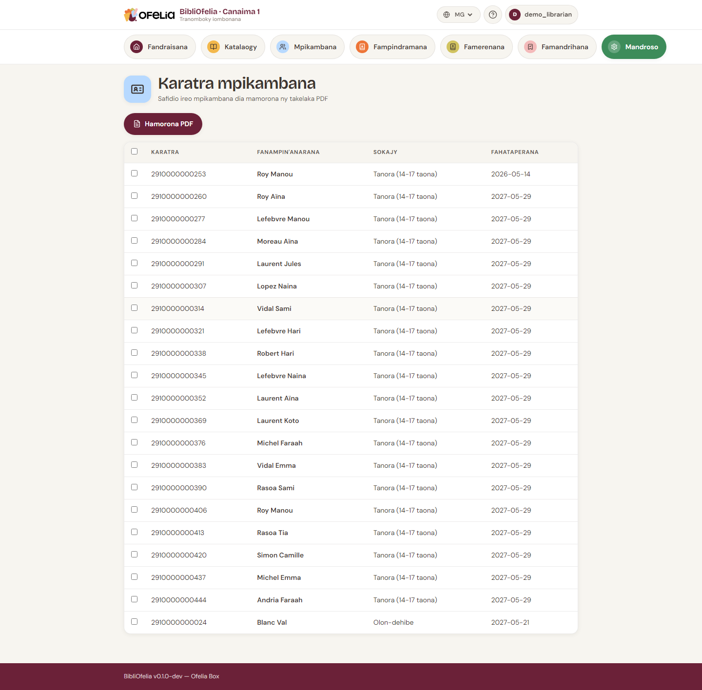

# Karatra mpianatra

Ny mpianatra tsirairay dia manana karatra ara-batana misy code-barre.
Izy no mamela ny fahalalana haingana azy mandritra ny fampindramana.

## Manonta karatra tokana

Avy amin'ny [takelakan'ny mpianatra](fiche.md), click amin'ny
**Hanonta ny karatra** (na mandehana ao amin'ny **Mandroso →
Fanontana → Karatra**).

## Manonta karatra maro miaraka

Ho an'ireo fisoratana vaovao, mahay kokoa ny manangona:

1. Sokafy **Mandroso → Fanontana → Karatra**
2. Mifitana ireo mpianatra hatontana (ohatra, "voasoratra ity volana
   ity")
3. Marino ireo karatra tianao
4. Click amin'ny **Hamorona PDF**

Ny PDF dia misokatra amin'ny onglet vaovao: azonao atonta mivantana
na tahirizina ho an'ny aoriana.

## Endrika karatra

Ny karatra BibliOfelia dia amin'ny endrika standard an'ny karatra
fitsidihana (85 × 54 mm) miaraka amin'ny:

- Logo **OFELIA** filigrane
- **Sary mpianatra** (any ambony havia, raha nomena)
- **Anarana sy anaran-drazana** lehibe
- **Laharan-karatra** sy **code-barre EAN-13**
- **Daty fahataperana**
- **Saina** mampiseho ny fiteny tian'ny mpianatra

Ny fond dia kremy mba hifanaraka amin'ny marika OFELIA.

!!! tip "Inona no taratasy ampiasaina?"
    Ho an'ny karatra mafy, manontaka amin'ny taratasy 200-300 g/m²
    dia plastifia. Azonao koa atao ny manonta amin'ny etikety
    miankina mba hapetraka amin'ny karatra efa voatonta foana.

## Hanolo karatra

Raha very ny karatry ny mpianatra, tsy maintsy manome **laharana
vaovao** ianao (fa tsy mamerina ny taloha) mba hanafoanana ny
karatra very:

1. Sokafy ny takelaky ny mpianatra
2. Click amin'ny **Hanolo ny karatra**
3. Marino

Laharana vaovao no nomena ary ny taloha dia "voapetraka": tsy ho
omena mpianatra hafa mihitsy intsony (jereo [Ohatra: karatra
very](../cas-courants/carte-perdue.md)).

Avy eo atontao ny karatra vaovao araka ny mahazatra.

## Jereo koa

- [Karatra very na nangalarina](../cas-courants/carte-perdue.md)
- [Fanavaozana sy fahataperana](renouvellement.md)
