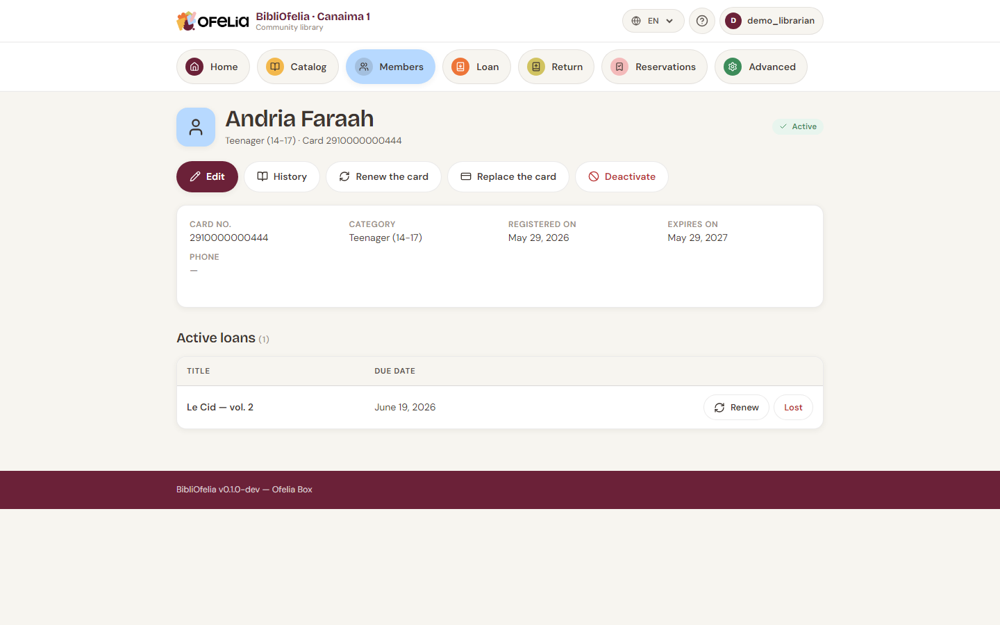

# Member profile

A member's profile gathers all their information and loan history.

## Reaching it

- From **Members**, click the name in the list
- From any page, type the name in the global search (at the top), or
  scan their card
- From the **Lend** page, the identified member becomes a link to
  their profile

## What you see

At the top, the header shows:

- **Photo** (if provided) and full name
- **Category** and **card number**
- **Status badge**: Active, Inactive or Card expired

Below, a summary card with:

- Card number, category, enrollment date, expiration date, phone, email

And the **Active loans** section listing currently borrowed books with
their title and return date.

## Available actions

The buttons under the name give access to operations:

- **Edit** — change contact info, photo, category
- **History** — see all past loans
- **Renew card** — push back the expiration date
  ([details](renouvellement.md))
- **Replace card** — assign a new card number (lost, stolen or
  damaged card)
- **Deactivate** — freeze the account without deleting it

## View history

Click **History** to open the chronological list of all the member's
loans, finished or current, with dates and titles.

!!! tip "How many times has this book been borrowed?"
    To see a book's history rather than a member's, open the record
    page: it also displays the loan history.

## Deactivate vs delete

- **Deactivate**: the member can no longer borrow, but their profile
  and history remain visible. Reversible.
- **Delete**: permanent erasure. Only possible if the member has no
  active loan and no active reservation.

Prefer deactivation for members who leave or no longer come to the
library: their history stays accessible.
