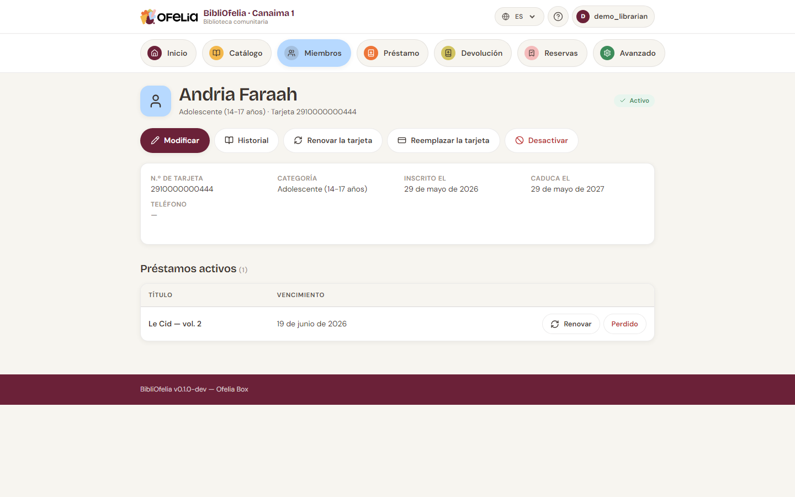

# Ficha de miembro

La ficha de un miembro reúne toda su información y el historial de
sus préstamos.

## Cómo acceder a ella

- Desde [**Miembros**](/bibliofelia/es/members/){ target="_blank" }, haga clic
  en el nombre en la lista
- Desde cualquier página, escriba el nombre en la búsqueda global
  (arriba), o escanee su tarjeta
- Desde la página [**Préstamo**](/bibliofelia/es/loans/lend/){ target="_blank" },
  el miembro identificado se convierte en un enlace a su ficha

## Lo que ve

Arriba, la cabecera muestra:

- **Foto** (si se proporciona) y nombre completo
- **Categoría** y **número de tarjeta**
- **Insignia de estado**: Activo, Inactivo o Tarjeta expirada

Justo bajo los botones, el recuadro **Cuenta** dice de un vistazo si
el usuario está **al día**, si tiene un importe **a pagar**, o si
está **atrasado** (desde cuándo). El detalle se reparte: cuota,
animación, multa. Véase [Caja y facturas](../caisse/caisse.md).

Más abajo, una tarjeta resumen con:

- Número de tarjeta, categoría, fecha de inscripción, fecha de
  expiración, teléfono, correo, dirección (calle, código postal,
  localidad, país)

Un **Comentario** (hasta 500 caracteres) aparece si se rellenó en
**Modificar → Opciones avanzadas**.

Y la sección **Préstamos activos** que lista los libros actualmente
prestados con su título y fecha de devolución.

## Acciones disponibles

Los botones bajo el nombre dan acceso a las operaciones:

- **Modificar** — cambiar los datos de contacto, la foto, la
  categoría
- **Historial** — ver todos los préstamos pasados
- **Renovar la tarjeta** — posponer la fecha de expiración
  ([detalles](renouvellement.md)). El botón está gris mientras la
  tarjeta sigue válida más de 30 días.
- **Reemplazar la tarjeta** — asignar un nuevo número de tarjeta
  (tarjeta perdida, robada o dañada)
- **Imprimir la tarjeta (62 mm)** — abre el PDF de cinta Brother QL
  en una pestaña nueva, sin pasar por Avanzado → Impresión
- **Desactivar** — congelar la cuenta sin eliminarla
- **Cuenta y facturas** / **Multa** / **Gastos de animación** — véase
  [Caja](../caisse/caisse.md)

## Ver el historial

Haga clic en **Historial** para abrir la lista cronológica de todos
los préstamos del miembro, terminados o activos, con fechas y
títulos.

!!! tip "¿Cuántas veces se ha prestado este libro?"
    Para ver el historial de un libro en lugar de un miembro, abra
    la ficha del registro: también muestra el historial de
    préstamos.

## Desactivar vs eliminar

- **Desactivar**: el miembro ya no puede prestar, pero su ficha e
  historial siguen visibles. Reversible.
- **Eliminar**: borrado definitivo. Solo posible si el miembro no
  tiene préstamo activo ni reserva activa.

Prefiera la desactivación para miembros que se van o ya no
frecuentan la biblioteca: su historial sigue consultable.
