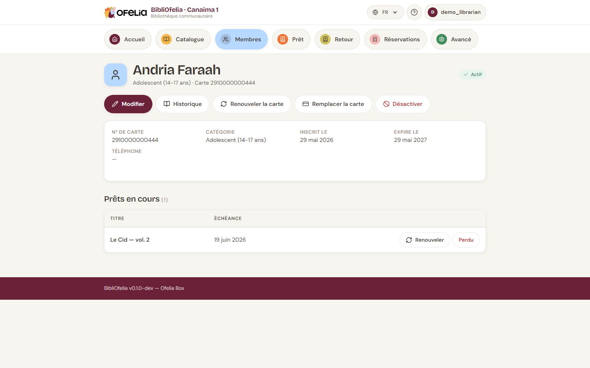

# Fiche membre

La fiche d'un membre regroupe toutes ses informations et l'historique
de ses prêts.

## Y accéder

- Depuis [**Membres**](/bibliofelia/fr/members/){ target="_blank" }, cliquez
  sur le nom dans la liste
- Depuis n'importe quelle page, tapez le nom dans la recherche globale
  (en haut), ou scannez sa carte
- Depuis la page [**Prêt**](/bibliofelia/fr/loans/lend/){ target="_blank" }, le
  membre identifié devient un lien vers sa fiche

## Ce que vous voyez

En haut, l'en-tête affiche :

- **Photo** (si fournie) et nom complet
- **Catégorie** et **numéro de carte**
- **Badge de statut** : Actif, Inactif ou Carte expirée

Juste sous les boutons, l'encadré **Compte** dit en un coup d'œil si
l'usager est **à jour**, s'il a un montant **à régler**, ou s'il est
**en retard** (depuis quelle date). Le détail est ventilé : cotisation,
animation, amende. Voir [Caisse et factures](../caisse/caisse.md).

Plus bas, une carte récapitulative avec :

- Numéro de carte, catégorie, date d'inscription, date d'expiration,
  téléphone, email, adresse (rue, code postal, localité, pays)

Un **Commentaire** (jusqu'à 500 caractères) s'affiche s'il a été saisi
dans **Modifier → Options avancées**.

Et la section **Prêts en cours** qui liste les livres actuellement
empruntés avec leur titre et leur date de retour.

## Actions disponibles

Les boutons sous le nom donnent accès aux opérations :

- **Modifier** — changer les coordonnées, la photo, la catégorie.
  C'est aussi là qu'on **renouvelle** ou **remplace** la carte (n° en
  haut du formulaire, date d'expiration dans Options avancées, ouvertes
  par défaut). Voir [renouvellement](renouvellement.md).
- **Historique** — voir tous les prêts passés
- **Imprimer la carte (62 mm)** — ouvre le PDF ruban Brother QL dans
  un nouvel onglet, sans passer par Avancé → Impressions
- **Désactiver** — geler le compte sans le supprimer
- **Compte et factures** / **Amende** / **Frais d'animation** — voir
  [Caisse](../caisse/caisse.md)

## Voir l'historique

Cliquez sur **Historique** pour ouvrir la liste chronologique de tous
les prêts du membre, terminés ou en cours, avec dates et titres.

!!! tip "Combien de fois ce livre a-t-il été emprunté ?"
    Pour voir l'historique d'un livre plutôt que d'un membre, ouvrez la
    fiche de la notice : elle affiche aussi l'historique des prêts.

## Désactiver vs supprimer

- **Désactiver** : le membre ne peut plus emprunter, mais sa fiche et
  son historique restent visibles. Réversible.
- **Supprimer** : effacement définitif. Possible uniquement si le
  membre n'a pas de prêt en cours et aucune réservation active.

Préférez la désactivation pour les membres qui partent ou ne
fréquentent plus la bibliothèque : leur historique reste consultable.
