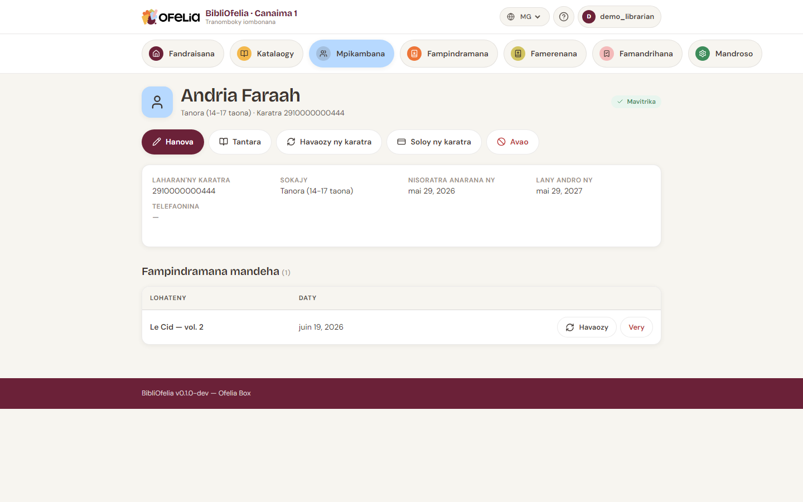

# Takelaka mpianatra

Ny takelaky ny mpianatra dia manangona ny vaovao rehetra sy ny
tantaran'ny fampindramany.

## Hahafahana mahatratra azy

- Avy ao amin'ny [**Mpianatra**](/bibliofelia/mg/members/){ target="_blank" },
  click amin'ny anarana ao amin'ny lisitra
- Avy amin'ny pejy rehetra, soraty ny anarana ao amin'ny fikarohana
  ankapobeny (any ambony), na jereo ny karatrany
- Avy ao amin'ny pejy [**Fampindramana**](/bibliofelia/mg/loans/lend/){ target="_blank" },
  ny mpianatra voafantatra dia lasa lien mankany amin'ny takelakany

## Izay hitanao

Any ambony, ny lohateny dia mampiseho:

- **Sary** (raha nomena) sy anarana feno
- **Sokajy** sy **laharan'ny karatra**
- **Insigne toetra**: Mavitrika, Tsy mavitrika na Karatra tapitra

Eo ambanin'ny bokotra, ny boaty **Kaonty** dia milaza haingana raha
**tsy trosa** ny mpianatra, raha misy vola **aloha**, na raha **tara**
(nanomboka oviana). Ny antsipiriany: saram-pianarana, animation, sazy.
Jereo [Caisse sy faktiora](../caisse/caisse.md).

Etsy ambany, takelaka famintinana misy:

- Laharan'ny karatra, sokajy, daty fisoratana, daty fahataperana,
  telefonina, mailaka, adiresy (lalana, kaody paositra, tanàna,
  firenena)

**Fanamarihana** (hatramin'ny litera 500) dia miseho raha voasoratra
ao amin'ny **Hanova → Options avancées**.

Ary ny fizarana **Fampindramana mihazo** mametra ireo boky
nampindramin'ny olona ankehitriny miaraka amin'ny lohateny sy ny
daty famerenana.

## Asa azo atao

Ny bokotra eo ambanin'ny anarana dia manome alalana ny asa:

- **Hanova** — manova ny vaovao fifandraisana, sary, sokajy. Ao koa
  no **hanavaozana** na **hanoloana** ny karatra (laharana eo an-tampon'ny
  formulaire, daty fahataperana ao amin'ny Options avancées, misokatra
  ho azy). Jereo [fanavaozana](renouvellement.md).
- **Tantara** — mijery ny fampindramana taloha rehetra
- **Hanonta ny karatra (62 mm)** — manokatra ny PDF ruban Brother QL
  amin'ny onglet vaovao, tsy mila Avancé → Fanontana
- **Hampijanona** — mametraka kaonty fa tsy mamafa
- **Kaonty sy faktiora** / **Sazy** / **Saran'ny animation** — jereo
  [Caisse](../caisse/caisse.md)

## Jereo ny tantara

Click amin'ny **Tantara** mba hanokafana ny lisitra arak'andro an'ny
fampindramana rehetra an'ny mpianatra, vita na mbola mihazo,
miaraka amin'ny daty sy ny lohateny.

!!! tip "Im-piry ity boky ity no nampindramina?"
    Mba hijerena tantaran'ny boky fa tsy mpianatra, sokafy ny
    takelaka notice: mampiseho koa ny tantaran'ny fampindramana izy.

## Hampijanona vs hamafa

- **Hampijanona**: tsy afaka mampindrana intsony ny mpianatra fa
  ny takelaka sy ny tantarany dia mbola hita. Azo averina.
- **Hamafa**: famafana tanteraka. Mety raha tsy manana fampindramana
  mihazo na famandrihana mavitrika ihany ny mpianatra.

Aleo hampijanona ho an'ireo mpianatra miala na tsy mankany amin'ny
tranomboky intsony: ny tantarany dia mijanona azo jerena.
