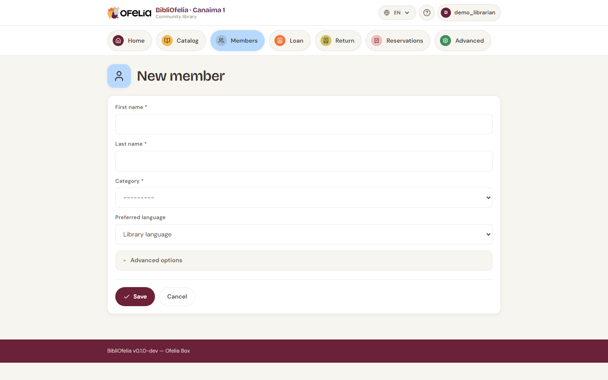

# Enrolling a new member

Enrolling a new reader takes less than a minute. All you need is their
name and category.

## Open the form

Two paths to open the enrollment form:

- From the [**dashboard**](/bibliofelia/en/){ target="_blank" }, click
  [**Enrollment**](/bibliofelia/en/members/new/){ target="_blank" } (shortcut)
- From [**Members**](/bibliofelia/en/members/){ target="_blank" }, click
  [**+ New member**](/bibliofelia/en/members/new/){ target="_blank" }

## Fill in the form

- **First name** and **Last name** (required)
- **Category** — Adults, Children, Teens… (configured by the
  administrator). The category sets the default loan duration and the
  maximum number of simultaneous loans.
- **Phone**, **email**, **address** (all optional)
- **Enrollment date** — today by default
- **Expiration date** — calculated automatically (enrollment + 1
  year), editable

!!! tip "Member photo (optional)"
    You can add a photo of the member's face. It will appear on the
    profile and the printed card. Useful to quickly identify children
    or new readers.

## Save

Click **Save**. BibliOfelia automatically assigns:

- A unique **card number** (starts with 291 — this is the card's
  barcode)

You can then move on to printing the card.

You arrive on the [member's profile](fiche.md), where you can
immediately print the card or register a first loan.

## What's next?

- [Print the member card](carte.md)
- [Lend a book](../prets-retours/faire-pret.md)
- If needed, add a photo or notes via the **Edit** button on the
  profile

## Special case: card lost before enrollment

If a member loses the card right after enrollment (before printing),
nothing to do: just reprint the card with the already-assigned
number. The card only physically exists at the moment of printing.
