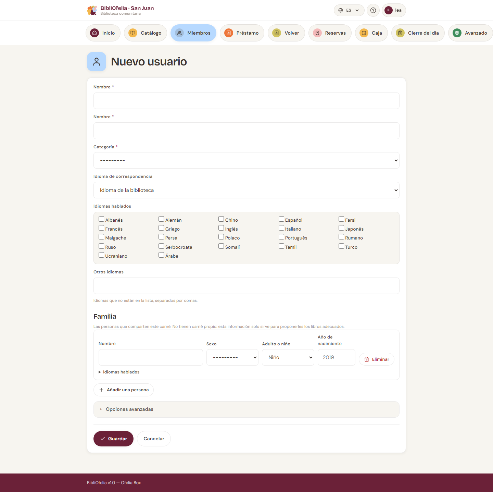

# Inscribir un nuevo miembro

Inscribir a un nuevo lector toma menos de un minuto. Solo necesita su
nombre y categoría.

## Abrir el formulario

Dos rutas para abrir el formulario de inscripción:

- Desde el [**panel**](/bibliofelia/es/){ target="_blank" }, haga clic en
  [**Inscripción**](/bibliofelia/es/members/new/){ target="_blank" } (atajo)
- Desde [**Miembros**](/bibliofelia/es/members/){ target="_blank" }, haga clic en
  [**+ Nuevo miembro**](/bibliofelia/es/members/new/){ target="_blank" }

## Rellenar el formulario

- **Nombre** y **Apellido** (obligatorios)
- **Categoría** — Adultos, Niños, Adolescentes… (configurada por el
  administrador). La categoría determina la duración del préstamo
  predeterminada y el número máximo de préstamos simultáneos.
- **Teléfono**, **correo** (opcionales — el correo sirve para
  facturas y recordatorios)
- **Dirección** troceada: calle, complemento, código postal,
  localidad, estado, país (todos opcionales)
- **Fecha de inscripción** — hoy por defecto
- **Fecha de expiración** — calculada automáticamente según la
  validez de la categoría (a menudo 1 año), modificable
- **Comentario** — en **Opciones avanzadas**, hasta 500 caracteres

!!! tip "Foto del miembro (opcional)"
    Puede añadir una foto del miembro. Aparecerá en la ficha y en la
    tarjeta impresa. Útil para identificar rápidamente a los niños o
    a los nuevos lectores.

### Los idiomas hablados

Debajo de la categoría, un recuadro enumera 22 idiomas. Marque **todos** los
que hable la persona: no hay límite. Lo que falte en la lista se escribe en
**Otros idiomas**, separado por comas.

No hay que confundirlo con **Idioma**, justo encima: ese dice en qué idioma
debe BibliOfelia **escribirle** (avisos, cartas). Los idiomas hablados
sirven para acogerle y proponerle los libros adecuados.

### La familia

La sección **Familia** enumera las personas que comparten este carné: pareja,
abuelos, hijos. Para cada una: **nombre**, **sexo**, **Adulto o niño**, y los
**idiomas** que habla (el mismo recuadro, plegado bajo "Idiomas hablados").

Para un niño, indique su **año de nacimiento**: BibliOfelia deduce la edad y la
mantiene al día por sí solo. Para un adulto no hay nada más que rellenar.

Haga clic en **Añadir una persona** para una línea más, y en **Quitar** para
eliminar una. Una línea sin nombre simplemente se ignora: puede dejar vacía la
línea que se le ofrece.

!!! info "Estas personas no son miembros"
    No tienen carné ni préstamos a su nombre. Esta información solo sirve para
    orientar las propuestas de lectura. Si quiere que una de ellas tome prestado
    ella misma, inscríbala como miembro de pleno derecho.

    Sus nombres aparecen en el [carné de miembro](carte.md) impreso.

## Guardar

Haga clic en **Guardar**. BibliOfelia asigna automáticamente:

- Un **número de tarjeta** único (empieza por 291 — es el código de
  barras de la tarjeta)
- Una **factura de cuota** si la categoría tiene un importe (0 =
  gratis, no se emite nada). Véase
  [Tarifas y categorías de usuarios](../caisse/tarifs.md).

Después puede pasar a la impresión de la tarjeta.

Llega a la [ficha del miembro](fiche.md), donde puede inmediatamente
imprimir su tarjeta o registrar un primer préstamo.

## ¿Qué hacer después?

- [Imprimir la tarjeta de miembro](carte.md)
- [Hacer un préstamo](../prets-retours/faire-pret.md)
- Si es necesario, añadir una foto o notas mediante el botón
  **Modificar** de la ficha

## Caso especial: tarjeta perdida antes de la inscripción

Si un miembro pierde su tarjeta justo después de la inscripción
(antes de imprimir), no tiene nada que hacer: basta con reimprimir
la tarjeta con el número ya asignado. La tarjeta solo existe
físicamente al momento de la impresión.
