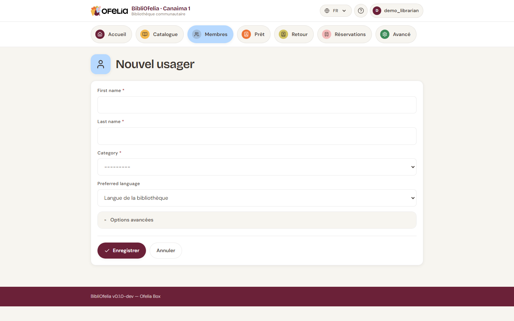

# Inscrire un nouveau membre

L'inscription d'un nouveau lecteur prend moins d'une minute. Vous
n'avez besoin que de son nom et de sa catégorie.

## Ouvrir le formulaire

Deux chemins pour ouvrir le formulaire d'inscription :

- Depuis le **dashboard**, cliquez sur **Inscription** (raccourci)
- Depuis **Membres**, cliquez sur **+ Nouveau membre**

## Remplir le formulaire

- **Prénom** et **Nom** (obligatoires)
- **Catégorie** — Adultes, Enfants, Adolescents… (configurée par
  l'administrateur). La catégorie détermine la durée de prêt par
  défaut et le nombre maximum de prêts simultanés.
- **Téléphone**, **email**, **adresse** (tous facultatifs)
- **Date d'inscription** — date du jour par défaut
- **Date d'expiration** — calculée automatiquement (inscription + 1
  an), modifiable

!!! tip "Photo du membre (facultatif)"
    Vous pouvez ajouter une photo du visage du membre. Elle apparaîtra
    sur sa fiche et sur sa carte imprimée. Pratique pour identifier
    rapidement les enfants ou les nouveaux lecteurs.

## Enregistrer

Cliquez sur **Enregistrer**. BibliOfelia attribue automatiquement :

- Un **numéro de carte** unique (commence par 291 — c'est le code-barres
  de la carte)

Vous pouvez ensuite passer à l'impression de la carte.

Vous arrivez ensuite sur la [fiche du membre](fiche.md), où vous pouvez
immédiatement imprimer sa carte ou enregistrer un premier prêt.

## Que faire ensuite ?

- [Imprimer la carte de membre](carte.md)
- [Faire un prêt](../prets-retours/faire-pret.md)
- Si nécessaire, ajouter une photo ou des notes via le bouton
  **Modifier** de la fiche

## Cas particulier : carte perdue avant inscription

Si un membre a perdu sa carte juste après l'inscription (avant impression),
vous n'avez rien à faire : il suffit de réimprimer la carte avec le
numéro déjà attribué. La carte n'existe physiquement qu'au moment de
l'impression.
