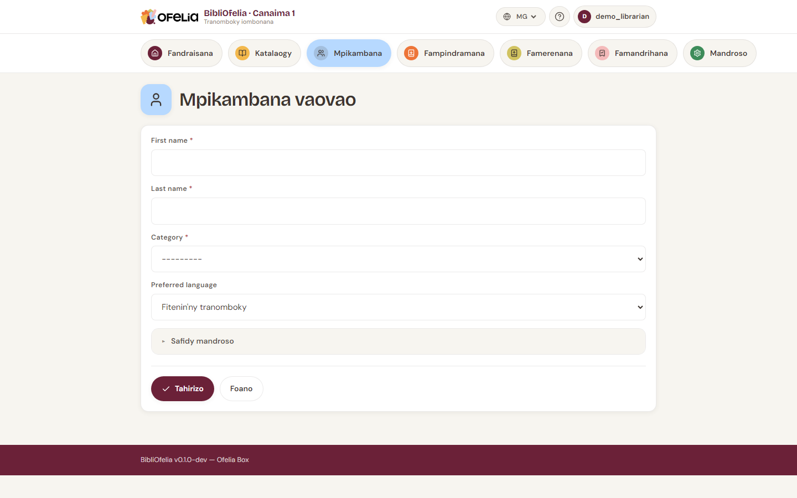

# Fisoratana mpianatra vaovao

Ny fisoratana mpamaky vaovao dia maharitra latsaky ny minitra iray.
Tsy mila afa-tsy ny anarany sy ny sokajiny ianao.

## Sokafy ny formulaire

Lalana roa hanokarana ny formulaire fisoratana:

- Avy ao amin'ny **tabilao**, click amin'ny **Fisoratana** (lavitra)
- Avy ao amin'ny **Mpianatra**, click amin'ny **+ Mpianatra vaovao**

## Fenoy ny formulaire

- **Anarana** sy **Anaran-drazana** (tsy maintsy)
- **Sokajy** — Olon-dehibe, Ankizy, Tanora… (apetraky ny
  mpitantana). Ny sokajy dia mametra ny faharetan'ny fampindramana
  sy ny isan-kalehibe an'ny fampindramana miaraka.
- **Telefonina**, **mailaka**, **adiresy** (rehetra tsy voatery)
- **Daty fisoratana** — anio araka ny default
- **Daty fahataperana** — kajiana automatika (fisoratana + 1 taona),
  azo ovaina

!!! tip "Sary mpianatra (tsy voatery)"
    Azonao ampiana sary an'ny tarehin'ny mpianatra. Hiseho amin'ny
    takelaka sy amin'ny karatra voatonta izy. Tsara mba hahafantarana
    haingana ireo ankizy na ireo mpamaky vaovao.

## Tehirizo

Click amin'ny **Tehirizo**. Ny BibliOfelia dia manome automatika:

- **Laharan'ny karatra** miavaka (manomboka amin'ny 291 — io no
  code-barre an'ny karatra)

Azonao avy eo atao ny fanontana ny karatra.

Tonga amin'ny [takelakan'ny mpianatra](fiche.md) ianao, izay azonao
atao avy hatrany ny manonta ny karatrany na manoratra fampindramana
voalohany.

## Inona avy eo?

- [Manonta karatra mpianatra](carte.md)
- [Mampindrana boky](../prets-retours/faire-pret.md)
- Raha ilaina, ampiana sary na notes amin'ny bokotra **Hanova** an'ny
  takelaka

## Toe-javatra manokana: karatra very alohan'ny fisoratana

Raha very ny karatry ny mpianatra avy hatrany aorian'ny fisoratana
(alohan'ny fanontana), tsy misy zavatra atao: tonga atontao
indray ny karatra miaraka amin'ny laharana efa nomena. Ny karatra
dia tsy misy ara-batana raha tsy amin'ny fotoana fanontana.
